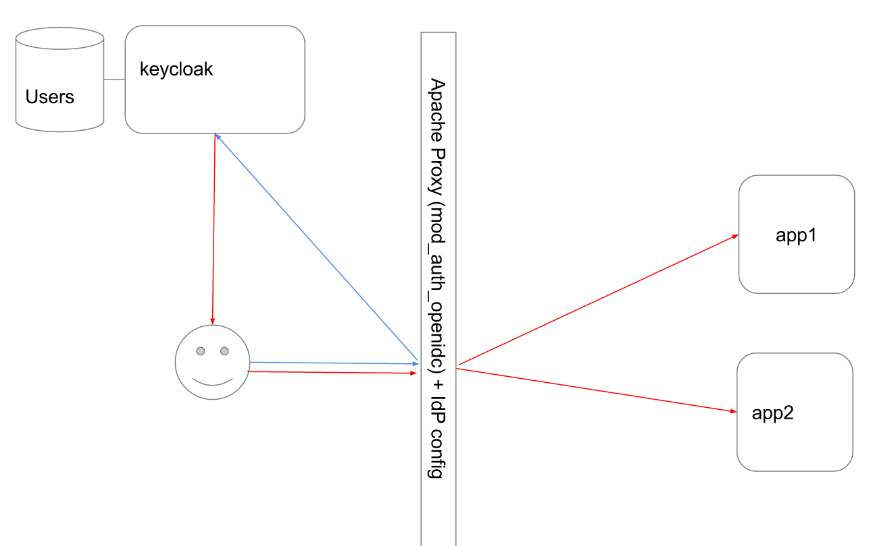

# identity-federation
Author : Selim BENSENOUCI

#What is that?

Simple POC using keycloak as IDP and mod_auth_openidc to federate SSO for 2 applications.   
with front http proxy.

#System Requirements

Docker Engine version 1.7.1 or greater   
Docker-compose

#Components

* keycloak as OpenID Provider (IDP).
* java-app, simple java app that print logged user informations.
* php-app, simple php app service provider associated with the IDP.
* httpd-openidc, front proxy that resolve openid access ton my apps.

#RUN
      git clone https://github.com/alizarion/identity-federation.git
      cd identity-federation
      docker-compose up

* After container start, go to http://localhost/, you will access to the index of the http proxy   
* Select on of the exposed app, you will be redirected keycloak IDP
* log with the user John Doe.    
      * username :  john
      * password :  azerty
* you after that you will be redirected to the app that you have select at the first step.
* you can also access to the second with the same identity token.

#How ?

